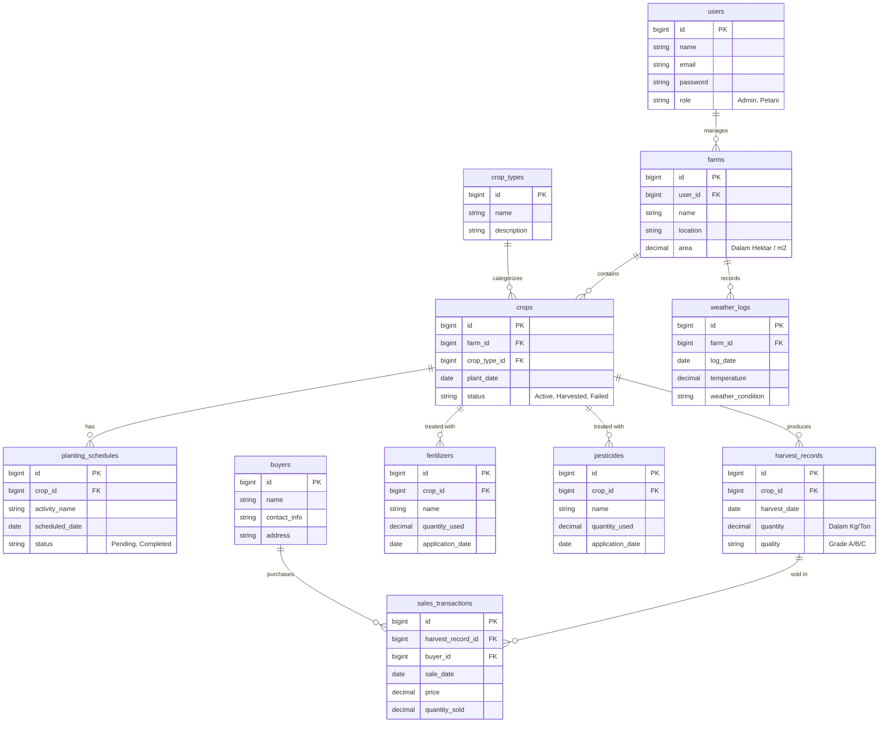

# Product Requirements Document (PRD)
## Aplikasi Manajemen Pertanian Sederhana

**Status:** Draft | **Target Framework:** Laravel 13 | **Database:** MySQL/PostgreSQL (SQLite untuk Development)

---

## 1. Ringkasan Eksekutif (Executive Summary)
Aplikasi Manajemen Pertanian Sederhana adalah sebuah platform *web-based* yang dirancang untuk memodernisasi cara petani, penyuluh, dan pengelola lahan mencatat serta memantau siklus pertanian mereka. Aplikasi ini berfungsi sebagai pusat kontrol untuk menjadwalkan penanaman, melacak penggunaan bahan-bahan kimia (pupuk dan pestisida), memantau kondisi cuaca, serta mencatat hasil panen dan penjualan. Tujuannya adalah untuk meningkatkan efisiensi dan transparansi data, sehingga keputusan operasional dan agrobisnis dapat dilakukan berdasarkan data yang akurat.

## 2. Tujuan Produk (Product Goals)
- **Digitalisasi Rekam Jejak:** Mengubah pencatatan manual (kertas) menjadi log digital yang terpusat dan aman.
- **Peningkatan Efisiensi:** Membantu petani menjadwalkan masa tanam dan panen secara terstruktur.
- **Analitik Sederhana:** Menyediakan informasi *real-time* tentang jumlah panen dan penjualan, sehingga perhitungan untung-rugi pertanian lebih jelas.
- **Kemudahan Penggunaan:** Memberikan antarmuka yang intuitif (menggunakan NiceAdmin Bootstrap) agar mudah diadopsi oleh pengguna dengan berbagai tingkat literasi digital.

## 3. Target Pengguna (User Personas)
1. **Petani / Pengelola Lahan (Farmer):** 
   - Aktor utama yang menginput data aktivitas operasional harian.
   - Kebutuhan: UI yang sangat responsif di perangkat *mobile* (smartphone) atau tablet.
2. **Penyuluh Pertanian (Supervisor/Admin):**
   - Mengawasi keseluruhan proses, memantau grafik cuaca, melihat komparasi hasil panen.
   - Kebutuhan: Dashboard laporan produktivitas yang komprehensif.
3. **Pembeli (Buyer):**
   - Entitas bisnis atau perorangan yang datanya dicatat untuk keperluan rekam jejak penjualan (Customer Database).

## 4. Cakupan Fungsionalitas (Functional Scope)
- **Autentikasi & Otorisasi:** Sistem login dengan *Role-Based Access Control* (RBAC) untuk mengelola hak akses berdasarkan *role*.
- **Manajemen Lahan (Farm Management):** CRUD (Create, Read, Update, Delete) informasi lahan pertanian.
- **Manajemen Tanaman (Crop Management):** Pemilihan jenis komoditas tanaman dan pencatatan musim tanam pada lahan tertentu.
- **Penjadwalan (Scheduling):** Menetapkan tanggal target tanam, pemeliharaan, dan panen.
- **Log Perawatan & Cuaca:** Menginput catatan dosis pupuk, pestisida, serta suhu dan cuaca harian.
- **Pencatatan Panen (Harvesting):** Memasukkan angka realisasi hasil panen (kuantitas dan kualitas).
- **Transaksi Penjualan (Sales):** Menghubungkan stok hasil panen dengan pembeli melalui nota transaksi sederhana.

---

## 5. Skema Data & Arsitektur (Data Schema & Architecture)

Sebagai *Tech Lead*, saya telah merancang struktur *database* menggunakan prinsip relasional yang terstandardisasi (3NF). Arsitektur aplikasi ini akan mengusung *Monolithic MVC* bawaan Laravel yang kokoh dan mudah dirawat.

### 5.1. Penjelasan Naratif
Arsitektur basis data difokuskan pada 10 tabel utama (di luar sistem bawaan Laravel seperti tabel *jobs* atau *cache*). Berikut adalah narasi relasional antar entitas:

- **Users:** Sebagai sentral autentikasi. Seorang *User* (Petani/Admin) dapat mengelola banyak lahan (**Farms**). Relasi: `1-to-N` antara `Users` dan `Farms`.
- **Farms & Crops:** Setiap lahan (**Farms**) bisa ditanami oleh beberapa macam tanaman pada waktu yang berbeda. Data tanaman yang sedang berjalan (siklusnya) dicatat di tabel **Crops**. Jenis tanaman itu sendiri merujuk ke tabel referensi/master data bernama **Crop_Types**.
- **Perawatan & Jadwal:** Sebuah siklus penanaman (**Crops**) memiliki banyak jadwal aktivitas (**Planting_Schedules**), riwayat pemupukan (**Fertilizers**), dan penyemprotan (**Pesticides**).
- **Kondisi Lingkungan:** Lahan (**Farms**) memonitor kondisi lingkungannya melalui catatan **Weather_Logs** harian.
- **Hasil Panen & Penjualan:** Pada akhir siklus, tanaman (**Crops**) akan menghasilkan panen yang dicatat di **Harvest_Records**. Hasil panen ini lalu dijual, dicatat dalam **Sales_Transactions**, di mana setiap transaksi ditautkan dengan data profil pelanggan di tabel **Buyers**.

### 5.2. Visualisasi ERD (Entity Relationship Diagram)
Berikut adalah visualisasi struktur database menggunakan format Mermaid:

---

## 6. Kebutuhan Non-Fungsional (Non-Functional Requirements)
- **Performa (Performance):** Aplikasi harus memuat halaman kurang dari 2 detik karena diakses dari daerah dengan kemungkinan sinyal terbatas.
- **Keamanan (Security):** Semua *password* di-*hash* dengan Bcrypt. Input divalidasi ketat untuk menghindari celah injeksi SQL (XSS & SQLi protection bawaan Laravel).
- **Aksesibilitas (Accessibility):** Tampilan (UI) menggunakan warna kontras (melalui *theme* Bootstrap NiceAdmin) agar mudah dibaca di bawah sinar matahari secara langsung.

## 7. Fase Rilis (Release Plan)
- **v1.0 (MVP):** 
  Fokus pada pendataan master, lahan, jenis tanaman, pembuatan siklus tanaman (crops), dan mencatat hasil panen (harvest).
- **v1.1 (Operational Tracking):** 
  Penambahan fitur pencatatan cuaca, jadwal tanam (schedule), pupuk, dan pestisida.
- **v1.2 (Sales & Analytics):** 
  Fitur transaksi penjualan dengan *buyers*, dan perilisan *Dashboard* analitik beserta grafik komparasi.
